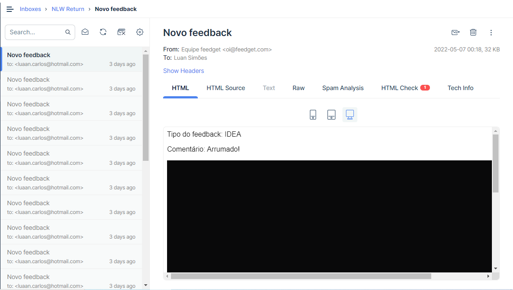
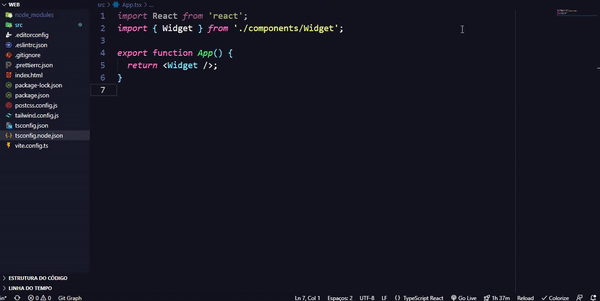
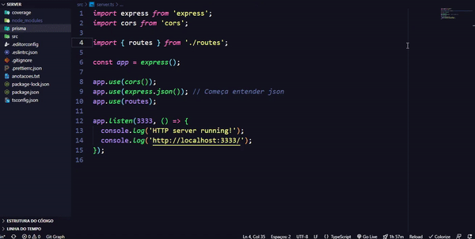

# Learning ReactJs/NodeJs
 Meu aprendizado com TypeScript/ReactJs e NodeJs na RocketSeat

 ✓ Working With TypeScript!  
 ✓ Working With Tailwind Css!  
 ✓ Working With Vite!  
 ✓ Working With PostCSS!  
 ✓ Working With Nodemailer!  
 ✓ Working With MailTrap!  
 ✓ Working With React!  
 ✓ Working With React-Redux!  
 ✓ Working With React-Router-Dom!  
 ✓ Working With React-Icons!  
 ✓ Working With Axios!  
 ✓ Working With EJS!  

 <h1>✅Project Front-End</h1>

 <h3>📚 Funcionamento</h3> 
 
 <h6 align="center">
    
 </h6>
 <h2></h2>

  <h6 align="center">
    
 </h6>
 <h2></h2>

  <h3>📚 Código</h3>

   <h6 align="center">
    
 </h6>
 <h2></h2>

  <h1>✅Project Back-End</h1>

  <h3>📚 Código</h3>

   <h6 align="center">
    
 </h6>
 <h2></h2>
